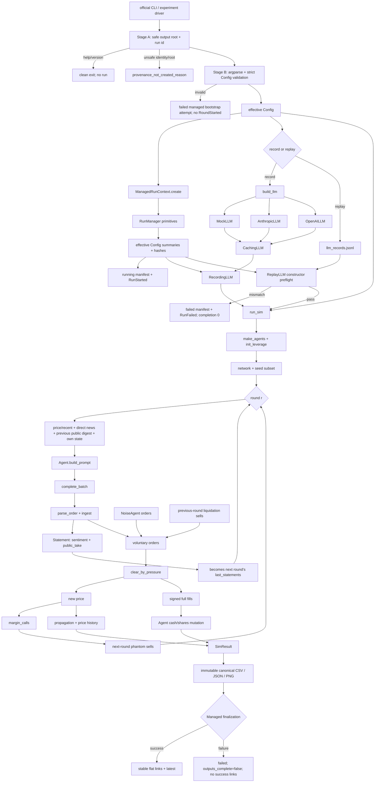

# 当前架构与真实数据流

本文描述 2026-07-22 工作区中的实际实现，不描述理想架构。核心入口是 `python3 -m nmsim.run`；`narrative_market_sim.py` 是已经分叉的旧 Phase-1 脚本。

> Phase 1–1.2B-CX1 与 Wave 0 建立 strict Record/Replay、统一 managed lifecycle、child reuse、Provider capability、Codex qualification 和 endpoint stochasticity 诊断。Wave 1 multi-event 又加入显式 opt-in public news timeline、strict decision-response schema、机器终态 health 和可见应用层 retry 证据；空 timeline、null decision schema 与未指定 SDK retry 继续保留 legacy 执行路径，但 Config/source identity 因新增机制而有意迁移。详细见 [RUN_PROVENANCE.md](RUN_PROVENANCE.md)、[RESULT_REUSE_POLICY.md](RESULT_REUSE_POLICY.md)、[PROVIDER_CAPABILITIES.md](PROVIDER_CAPABILITIES.md)、[MODEL_QUALIFICATION_PROTOCOL.md](MODEL_QUALIFICATION_PROTOCOL.md)、[CODEX_EXEC_PROVIDER.md](CODEX_EXEC_PROVIDER.md)、[ENDPOINT_STOCHASTICITY.md](ENDPOINT_STOCHASTICITY.md) 和 [MULTI_EVENT_PROTOCOL.md](MULTI_EVENT_PROTOCOL.md)。下文关于既有市场、社交和风控语义仍是 compatibility baseline。

## 模块责任

| 模块 | 当前责任 | 不负责的内容 |
|---|---|---|
| `nmsim/config.py` | 单一 `Config` dataclass、默认值和 JSON 序列化；包含 opt-in `news_timeline`、`decision_response_schema` 与 `provider_sdk_max_retries` | 没有独立 `ScenarioSpec`、完整取值/跨字段 domain validation、Config schema version 或 secret redaction |
| `nmsim/config_ingestion.py` | strict-default mapping ingestion、集中 alias、unknown/duplicate-source 校验和安全建议 | 不改默认值；不提供 `strict=False` 宽松迁移；不属于市场科学 allowlist |
| `nmsim/__init__.py` | 在正常包导入时将 strict ingestion 显式绑定到 `Config`，并回填 `nmsim.config` 的 alias/异常导出 | 不改 Config dataclass 字段或仿真语义 |
| `nmsim/config_contract.py` | 对最终有效 `Config` 逐字段 fail-closed 分类，生成稳定、脱敏的 scientific/model-request/execution 摘要与 hash | 不修改 Config 值；不替代 source fingerprint 或实际 resolved model config |
| `nmsim/types.py` | `Order`、`Statement` TypedDict 和 `Side` | 没有 `Decision`、fill、portfolio 或 event 类型 |
| `nmsim/prompts.py` | 六类 persona、real system/user prompt | 不执行 persona 数值 policy；不含数值 fundamental/social gain |
| `nmsim/agents.py` | Agent 状态、NoiseAgent、本地 Mock 参数、prompt 路由、response ingest、statement | 不做资金/库存风控；不保存 raw response |
| `nmsim/llm.py` | Mock/Anthropic/OpenAI-compatible、解析、async retry、内存 cache、成本估算、provider factory | 不保证真实 LLM 确定性；不把调用记录持久化；不做 main CLI health gate |
| `nmsim/codex_exec.py` | 实验性官方 Codex CLI 适配；安全 capability/auth probe、隔离 cwd、stdin/argv 子进程、结构化输出、工具事件拒绝和逐调用安全元数据 | 不是 API/HTTP 反代；不读认证文件；不允许工具结果成为 Decision；不改变生产 Prompt 或市场语义 |
| `nmsim/contagion.py` | network、feed、news seed、attention digest、sentiment/cascade 指标 | 不传播订单；cascade 不是隔离价格通道后的纯 contagion effect |
| `nmsim/market.py` | 净订单流压力价格、matched volume、全额 signed fills | 不是 LOB；不执行 limit；无显式 market maker/约束/库存守恒 |
| `nmsim/leverage.py` | 冻结参照杠杆多头、价格保证金、一次性强平、phantom sell order | 不改 Agent voluntary cash/shares；无真实债权人/清算执行账本 |
| `nmsim/sim.py` | 建人群和社交结构、逐轮 prompt/batch/order/price/portfolio/metrics/强平 | 不写文件；不做 config 校验或 provider health 判定 |
| `nmsim/validation.py` | returns、stylized facts、reaction、reference loader、RMSE、DTW | 不提供统计置信区间、多事件设计或失败样本处理 |
| `nmsim/events.py` | versioned 公共/私有 JSONL envelope、隐私键拦截 | 不改变 simulation 或推导反事实 |
| `nmsim/fingerprint.py` | 稳定计算 parser、Prompt、Persona、simulation core 的 schema/hash 与总科学指纹 | 不用整仓 commit 代替科学兼容性；不纳入文档、运行产物或私有日志 |
| `nmsim/recording.py` | logical LLM call Record/Replay；记录有效配置契约，并严格校验请求身份、model config、schema/hash、运行时科学配置和科学源指纹 | 不捕获 SDK 内部 retry 的中间 response；错配时不回退 Provider；不生成反事实回答 |
| `nmsim/reparse_audit.py` | 离线读取历史 raw response，用当前 `parse_order` 重新解析并逐字段对比 | 不构造 Provider、不继续仿真、不生成新价格轨迹 |
| `nmsim/provenance.py` | 底层不可覆盖 run directory、原子 manifest、Git/环境/source/config 契约、artifact hash 和安全兼容链接 | 不编排 simulation 或单独定义 managed 状态机；无 `.git` 时不能凭空恢复 commit |
| `nmsim/run_context.py` | `ManagedRunContext` 统一 Record/Replay、事件 observer、completion、failure stage、终态、artifact 登记和成功后兼容投影；`NullRunContext` 是显式 no-op 边界 | 不做 Agent 决策、Prompt、市场、社交、风控或指标计算 |
| `nmsim/managed_cli.py` | 两阶段 CLI bootstrap、安全 run id/output root、配置失败受管封存和公共脱敏错误 | `--help`/`--version` 不创建 run；不解释市场科学语义 |
| `nmsim/entrypoints.py` | 集中、可测试的入口分类与 management policy | 不 import Provider、不创建目录或运行仿真 |
| `nmsim/result_reuse.py` | policy 1.1 的 `ChildRunIdentity` / `ExpectedRunIdentity` / candidate 验证；校验 lifecycle、科学源/配置、模型请求、Scenario/input、population/seed、runtime environment、multi-event slot、路径与 artifact hash | 不运行 child、不覆盖旧结果、不把 legacy flat input 伪造成 managed run |
| `nmsim/provider_capabilities.py` | capability schema 1.0；对 resolved Mock/Anthropic/OpenAI-compatible、实验性 CodexExec 及 qualification-only Fake 提供保守、脱敏、fail-closed 的描述快照 | 不选择/构造 Provider，不读 credential，不测量模型质量或确定性 |
| `nmsim/run.py` | 主 CLI、Config 覆盖、通过 `ManagedRunContext` 组装 record/replay、六类兼容输出和终端摘要 | 不暴露全部 Config；不改变旧 market/social/risk 语义 |
| `experiments/run_seed.py` | 单个实验、Meta 对齐、health、compact orders、统一 provenance/record/replay；`--price-csv` 是另行标记的 historical analysis input | CSV analysis 不产生新 LLM events、不代表 child resume；旧根 JSON 只作兼容投影 |
| 正式 experiment driver | 管理 parent attempt 的 run-level completion，用集中 reuse gate 验证候选，调用受管 `run_seed` child，保留脱敏 summary/audit 和 0600 failure detail | 不把文件存在当作成功；不把 child 内 Decision 行数当作独立 N |
| 正式派生分析入口 | 在 managed analysis attempt 中读取历史 JSON/trace，把 legacy input 路径/大小/hash 和未验证身份计数入 manifest，并计算原有表/图 | 不伪造 child manifest；不统一或静默修改历史 analyzer 的过滤、配对和 CI 公式 |
| `experiments/model_qualification.py` | `run_kind=model_qualification` 的 managed 入口；加载冻结 protocol/fixtures/rubric，构造 6×8=48 cases，执行 Mock/Fake，支持 CodexExec 安全 dry-run，并以确认参数和 case 上限保护未来小规模真实试跑 | 不调用市场、不产生价格路径；Phase 1.2B-CX1 未执行真实 Codex case；低层函数不是绕过 CLI 确认的正式入口 |
| `experiments/endpoint_stochasticity.py` | `run_kind=endpoint_stochasticity` 的 managed Wave 0 入口；验证 qualification 48-case universe 和冻结 6-case 子集，执行 temp×K×concurrency 网格、独立 same-seed probe、pairwise byte agreement 与 within-case pooled sigma | 不调用 `run_sim`、不生成价格路径或市场 replicate；dry-run 不构造 Provider；真实 OpenAI-compatible 路径必须显式 `--live` |
| `experiments/multi_event.py` | 通过精确 path/hash 白名单分派版本化协议；workers=1 保留历史顺序 acquisition，workers=2 只并发同一 event/seed/repeat 的双臂并以 pair barrier 推进；各 profile 绑定独立 canonical live root、source snapshot 与 stage | 不聚合结果、不跨 workers profile 复用或混池、不把 ACTIVE/foreign-series materialization 当作可跳过失败、不声称真实 Provider 确定性 |
| `experiments/aggregate_multi_event.py` | 从一个完成的父 manifest 重验 profile-specific protocol/root/source/stage/paired-launch policy、plan/ledger/selection、runtime/alias/health/private artifact，并输出 complete-case seed-cluster 统计或明确不完整的 canary 描述 | 不按 glob 或 legacy flat 文件选择样本；不构造 Provider；workers=1/2 不混池；canary 不声称 full/realism/variance-component 结论；该 pilot 不升级为 confirmatory claim |
| `qualification/*.json` | protocol 1.1、字节不变的 8 个 Observation fixtures、rubric 1.1 和 field-level visibility contract 1.0 | 不包含未来价格、private rationale、评价答案或 rubric 泄漏到 Observation；真实 Prompt 不可见的 fundamental anchor 明确 not-scored |

## Scientific Component Fingerprint

`nmsim/fingerprint.py` 根据当前实际调用图，建立一个比 Git commit 更窄、但对科学行为更直接的兼容身份。`scientific_component_fingerprint` 的覆盖集是以下固定仓库相对路径：

1. `nmsim/agents.py`：observation/prompt 路由、Agent ingest 与可传播 statement。
2. `nmsim/config.py`：会影响实验的配置默认值与配置 schema。
3. `nmsim/contagion.py`：社交图、feed、attention 和级联指标。
4. `nmsim/leverage.py`：参照仓、保证金和强平逻辑。
5. `nmsim/llm.py`：Provider/Mock 请求路径与 `parse_order`。
6. `nmsim/market.py`：订单汇总、压力定价与 fills。
7. `nmsim/prompts.py`：Persona 字面量、system/user 提示词模板。
8. `nmsim/sim.py`：回合编排、事件顺序和状态更新。
9. `nmsim/types.py`：科学数据类型/schema。
10. `nmsim/validation.py`：会进入结果的验证指标。
11. `nmsim/decision_contract.py`：opt-in strict decision-response schema 与机器终态。
12. `nmsim/multi_event.py`：冻结协议、事件材料、slot/attempt identity 与参考路径变换。
13. `nmsim/reference_data/__init__.py`：公开 news timeline 的严格加载与 delivery 语义。
14. `experiments/run_seed.py`：正式单运行配置路由、multi-event result/health 组装。

稳定性规则如下：

- `simulation_core_source_hash` 对上述相对路径排序，将相对路径和文件原始字节分别做长度前缀后汇总 SHA-256；绝对路径、目录遍历顺序、时间戳和权限不进入 hash。
- `decision_parser_source_hash` 是 `parse_order` 这一个顶层函数的 LF-normalized 源码 hash；`decision_parser_schema_version` 是对应的显式解析契约版本。
- `prompt_source_hash` 保持 Phase 1 口径，为 `nmsim/prompts.py` 原始字节 hash；`persona_source_hash` 是对该文件中字面量 `PERSONAS` 做排序紧凑 JSON 序列化后的 hash。`Agent.build_prompt` 另由 core 集合覆盖。
- 总指纹对 `fingerprint_schema_version`、parser schema/hash、Prompt/Persona hash、core hash 和固定文件列表的 canonical JSON 做 SHA-256。`event_schema_version` 和 `recording_schema_version` 不被混入总指纹，而是 strict replay 中的独立必匹配字段。

`README`、`docs/`、测试、除 `experiments/run_seed.py` 外的实验 driver、`nmsim/run.py`、`nmsim/run_context.py`、`nmsim/managed_cli.py`、`nmsim/entrypoints.py`、`nmsim/events.py` 及 fingerprint/provenance/recording/reparse instrumentation、run directories、results 和 private logs 均不进入科学文件集。Event/recording 变化由独立 schema 版本管理；fingerprint 算法本身变化必须同步提升 `fingerprint_schema_version`。因此单纯文档或生命周期编排变化不应拒绝 replay。但这是保守集合：上述科学源文件按原始字节计算，即使只改其中的普通注释，也会使 core hash 改变并触发 strict replay 拒绝。`git_commit`/`git_dirty` 依然记录于 manifest 和 recording，但 commit 本身不是唯一兼容键。

## Effective Config 契约

Scientific Component Fingerprint 回答“执行的科学源码是否兼容”；`nmsim/config_contract.py` 另行回答“这次运行实际使用的配置是否兼容”。它对 CLI/实验脚本已合并到 `Config` 的最终值做稳定规范化，不改写任何配置或市场状态。`nmsim.run.run` 中原有的 `news_round > n_rounds` clamp 发生在 `RunManager.create` 之前，所以该入口 hash 的是 clamp 后的真实有效值；Phase 1.1A.1 没有为其他入口新增 clamp 或改变默认值。

41 个 `Config` 字段必须在显式 registry 中有 category 和 rationale，没有默认落入 execution 的分支。若 dataclass 新增字段而 registry 未同步，或 registry 残留已删除字段，`validate_config_classification` 立即抛出错误。当前分类为 29 个 scientific、10 个 model-request 和 2 个 execution 字段；边界是：

| 类别 | 典型字段/运行项 | hash 与 Strict Replay 行为 |
|---|---|---|
| scientific | seed/round/news、人口与 noise、价格与 kappa、social/network/digest、leverage/margin、`reference_path` 数据身份 | 进入 `scientific_config_hash`；任一差异在 preflight 拒绝 |
| model_request | requested provider/model/cheap-model、endpoint identity、temperature、max tokens、cache policy | 进入 `model_request_config_hash`；差异在 preflight 拒绝；resolved Provider/model 另由原有 secret-free `model_config` 逐键严格校验 |
| execution | `out_dir`、脱敏 credential 状态，以及 run ID、scenario label、output root、worker、声明的 batching 和 input locator 等运行上下文 | 进入 `execution_config_hash`；差异写入 replay manifest 但允许继续 |

每个 managed run 的 manifest 同时保存：

- `config_hash_schema_version` 和分类 mapping 的 `config_classification_hash`；
- 所有 Config 字段的 secret-free `effective_config_summary` 与 `full_effective_config_hash`；
- 三个 category 的字段列表、规范化摘要和 category hash。

`full_effective_config_hash` 对所有规范化后的 Config 字段做整体身份，因其中也有 execution 字段，它不被当成单一的阻断键。Strict Replay 分别使用 scientific/model-request hash 阻断科学或请求差异，并单独记录 execution 差异。规范化使用排序字段/键、tagged float hex、排序 set 和显式 Enum/tuple 表示；不支持的对象拒绝使用可含内存地址的 `repr` 充数。`reference_path` 存文件字节 SHA-256 与 size，不存绝对科学输入路径；endpoint 和 output/runtime path 只存脱敏 identity hash；API key 只有“已配置/未配置”与固定 redaction sentinel。

`population` 是一个必须保留当前语义的特例：原始 counts 按 key 排序用于审计，同时显式保存按当前 dict insertion order 产生的 `effective_cast`。该 cast 会影响 Agent、batch、社交图和 leverage cohort 顺序，因此不能为追求表面上的 dict 无序性而丢掉。

### Config 输入与 contract 分类是两个边界

正常包导入先执行 `nmsim/__init__.py`；它将 `nmsim/config_ingestion.py` 的 strict contract 安装到现有 `Config` class，并把 alias/异常类回填到 `nmsim.config` 导入表面。因此 `import nmsim`、`from nmsim import Config` 和 `from nmsim.config import Config` 这些受支持路径所得的 `Config.from_dict(data, strict=True)` 都会在构造 dataclass 前拒绝未知或含糊 mapping 输入。审计未找到历史 Config mapping alias，因此当前集中 map 为空；argparse 的 CLI flag 不被当作 alias 证据。机制和回归测试仍保证：未来只有经 artifact 证明的精确 alias 可在 unknown validation 前规范化，alias/canonical 重复在值相同时也拒绝。未知名按稳定顺序列出，近似建议不自动更正，输入值不进入错误，过长或 credential/private-shaped key 会截断/脱敏。`strict=False` 显式不支持：它抛出 `ConfigSchemaError`，不是一条可用于正式实验的 legacy 忽略通道。

正式单次入口 `nmsim.run`、`experiments.run_seed` 和 `experiments.capture_traces` 由 `argparse` 拒绝未知 CLI flag，然后显式构造 Config。Strict Replay 比较这个当前 effective Config 与 recording 摘要/hash，不会用宽松 `from_dict` 还原历史配置。配置文件或 manifest 恢复必须调用 strict ingestion。输入 unknown key 在 Config 构造时失败；已合法新增的 dataclass 字段若未进入 `CONFIG_FIELD_RULES`，则在 `validate_config_classification` 构建 contract 时失败。两者不可合并为一个默认 execution catch-all。

Phase 1.1B 把 CLI 启动分成 bootstrap 和 full validation。`--help`/`--version` 不创建 run。安全 output root/run id 已确定后，full validation 失败会创建明确标记 provisional Config 不可用于科学解释的 bootstrap attempt，以 `failure_stage=config_validation` 封存 failed manifest，不发出 `RoundStarted`、不调用 Provider/网络、不发布成功输出。非法 run id/路径穿越或安全 root 无法确定等极早期错误可能没有 manifest，但必须返回脱敏 `provenance_not_created_reason`。

### Scenario label 不是科学内容身份

`scenario_id`/label 当前是人类可读 execution metadata，修改 label 本身不阻止 Replay。当前真实 Scenario 内容由 `news_round`、`news_text`、受限的 opt-in `news_timeline`、`seed_fraction`、`reference_path` 内容身份以及 population/信息可见性等 scientific Config 约束。Manifest 的 `scenario.definition_sha256` 只是当前有限摘要的描述性 hash，不替代 scientific config contract。当前仍没有通用 `ScenarioSpec` / `EventStream` 抽象；未来引入时，payload、事件时间线、可见性策略和输入数据 hash 必须进入 scientific config 或独立 `scenario_content_hash`，不得只依靠 label。

## Phase 1.2A 实验编排边界

正式 driver resume 的实际调用链是：

```text
driver final child command
  -> ExpectedRunIdentity.from_effective_config
  -> ReusableRunCandidate(path, allowed_root)
  -> validate_child_run_reuse(policy 1.1)
     -> reject: audit reason(s), preserve candidate, execute new managed child
     -> accept: re-hash artifacts, count exactly one reused simulation replicate
```

`ChildRunIdentity` 从 managed manifest 读取 lifecycle、entrypoint、recording
schema、scientific fingerprint/parser/event/Prompt/Persona/core、运行时 scientific Config、Scenario/input/reference、seed/population、requested/resolved Provider/model/endpoint/request details、Git provenance 和 canonical artifacts。每个 artifact 都要在 child 目录内重新计算 size/SHA-256；symlink 还必须留在允许 result root 且指向同一 child。只改 README/docs 而科学指纹和其他身份不变时，可显式记录 `cross_commit_same_scientific_fingerprint=true` 并复用。

无合格 manifest 的 flat JSON/CSV/PNG 返回
`legacy_flat_result_unverified`，不得占用当前 experiment slot。Managed analysis 可以显式选取这些文件，但只以 `legacy_unverified_input` 记录路径、hash 和可读/失败/身份未验证数；它们不增加 executed/reused/honest-N。

Provider capability registry 与 reuse identity 是相关但不同的层。前者描述 resolved adapter 当前暴露的 transport/auth/batch/async/sampling/usage/record-replay/cache/tool/network/determinism 边界，并把 secret-free snapshot 可选写入 manifest；后者仍使用实际 model-request identity 决定 child 是否可复用。Capability 改变不会静默改变 Provider 实现，也不单独放宽 schema 1.2 Replay。

Model qualification 是旁路 managed flow：

```text
bootstrap -> validate/hash protocol + fixtures + rubric + visibility contract -> provider/selection guard
  -> dry-run (no Provider) OR 48 Mock/Fake logical calls OR explicitly confirmed Codex subset pilot
  -> public case results + aggregate diagnostics
  -> 0600 prompts/raw responses/private rationale
  -> managed finish with run_kind=model_qualification and honest_n_runs=0
```


Endpoint stochasticity 也是旁路 managed flow：

```text
bootstrap -> validate 48 qualification cases + frozen six-case panel -> provider/live guard
  -> dry-run (no Provider) OR 1080 main-grid calls + separate two-call same-seed probe
  -> public response hashes/parsed fields + within-case agreement/sigma
  -> 0600 prompts/raw responses/private rationale
  -> managed finish with run_kind=endpoint_stochasticity and honest_n_runs=0
```

这两个非市场 flow 都不进入下面的价格更新图。

## 从公开入口到价格更新



## 一轮仿真的实际编号流程

以下编号对应 `nmsim/sim.py:40-194` 的真实顺序。

1. **运行级初始化（第一轮前）**
   - `random.Random(cfg.seed + 1)` 创建 digest RNG。
   - `make_agents(cfg)` 生成 persona Agents 和 NoiseAgents；所有 Agent 初始 `cash=10000`、`shares=50`。
   - `init_leverage` 在启用时按 fuel-first 顺序选择 cohort，建立与 voluntary portfolio 分离的冻结参照多头。
   - 根据实际 LLM agent 名称建 graph；非 demoted influencer 是全连接 hub。
   - `choose_seed_agents` 固定直接看到新闻的子集；非 demoted influencer 强制加入。
   - provider wrapper 的 `kind != mock` 决定使用 real prompt，否则用 Mock structured prompt。

2. **截取行情观察**
   - `recent = history[-cfg.recent_window:]`。
   - 当轮决策使用回合开始时的 `price`，即上一轮 clearing 后价格。

3. **过滤上一轮公开广播池**
   - `broadcast_mode=all`：全部上一轮 statements。
   - `exclude_influencer`：去掉 influencer statement。
   - `only_influencer`：只保留 influencer statement。
   - 第 1 轮没有上一轮 statement，social feed 为空。

4. **逐个 LLM Agent 决定其 observation**
   - `r >= news_round and agent in seed_agents` 时直接看到完整 `news_text`；因此 seed 在以后每轮都会重复看到同一新闻。
   - `effective_weight = clip(cfg.social_weight * persona.social_weight, 0, 1)`。
   - 只有 `effective_weight>0` 且 pool 非空才生成 digest。
   - feed 模式看所有其他 statements；network 模式只看 adjacency neighbor statements。
   - visible statements 先 shuffle 打散同 conviction tie，再按 `abs(sentiment)` 降序取 `digest_size`。

5. **构造 prompt**
   - Real system：市场规则、persona 自然语言、JSON schema。
   - Real user：round、latest/recent price、trend、direct news、公开 feed、可选 mic note、自己的 shares/cash、最近 3 条 memory。
   - Real user **不含** `fundamental_value` 或 effective social weight 数值。
   - Mock prompt 额外含 `FUNDAMENTAL`、`SOCIAL_SENTIMENT`、`SOCIAL_WEIGHT` 和 `_MOCK_PARAMS_BY_ID`。

6. **整轮 batch 调用**
   - prompts 按 `llm_agents` 列表顺序组成一个 batch。
   - cache hit 直接填回原索引；所有 misses 传给 inner `complete_batch`。
   - Mock 依序同步完成；real provider 用 `asyncio.gather` 同时创建请求并保持返回列表顺序。
   - Anthropic/OpenAI async 单 prompt 最多尝试 3 次；parse failure 加严格 JSON reminder，异常最后转 hold JSON。

7. **解析和 Agent 私有状态更新**
   - `parse_order` 从 response 抽 JSON，规范 side/quantity/limit/sentiment/public/reasoning。
   - 原始 response 在此后丢弃；只保留已截断字段。
   - `order.agent` 被覆盖为 owner name。
   - `last_sentiment` 更新；memory 追加当轮 price/action 和 public_take（为空时 rationale）的 60 字符摘要。

8. **产生可传播 Statement**
   - statement 字段为 `agent`、`sentiment`、`side`、`text=public_take[:90]`。
   - neighbor digest 最终只取 statement 的 `sentiment` 和 `text`；`side` 不送给其他 Agent。
   - standard real schema 的 private `reasoning` 不进入 statement。

9. **计算 stance flip 和 seed sign**
   - 新旧 sentiment 乘积 `< -0.02` 计一次 flip。
   - 仅 news round 根据 seed agents 当轮 mean sentiment 决定 `seed_sign`；绝对均值不超过 0.3 时为 0。

10. **添加非 LLM 订单**
    - 每个 NoiseAgent 生成一个 1..8 股 buy/sell。
    - 上一轮 margin breach 生成的 `pending_liq` phantom sell orders 在此加入。

11. **汇总订单并压力清算**
    - `buy_q`/`sell_q` 汇总所有有效数量，`depth=buy_q+sell_q`。
    - `new_price = round(max(0.01, old_price * (1 + kappa*(buy_q-sell_q)/depth)), 2)`。
    - `volume = min(buy_q, sell_q)`。
    - 每笔 buy/sell 都按原 quantity 变成 signed fill；limit、cash、shares 均不参与资格判断。

12. **更新 voluntary portfolio**
    - 对每个真实 Agent：`shares += dq`；`cash -= dq * new_price`。
    - 买入可使 cash 为负，卖出可使 shares 为负；phantom liquidation seller 没有 Agent 实体，所以不进入这一循环。

13. **检查保证金并排队下一轮强平卖压**
    - 仅 `r >= news_round` 检查。
    - `equity_ratio=(ref_shares*price-debt)/(ref_shares*price)` 小于 maintenance 时，立即标记参照仓已清算并记录事件。
    - 生成 `ref_shares` 股 phantom sell，赋给下一轮 `pending_liq`；不是当轮重新 clearing。

14. **记录当轮**
    - `history` 和 `(round, price, volume)` 追加。
    - `traces[r]` 只保存 LLM orders 的解析后字段；不含 NoiseAgent、phantom order、raw response、fill 或 cash/shares。
    - propagation metrics 保存所有 LLM sentiment、flip、非 seed 与 seed sign 的对齐比例。
    - 本轮 statements 赋给 `last_statements`，在下一轮传播。

15. **循环结束**
    - 返回 `SimResult`。
    - `run.run` 计算 validation 并写文件；直接调用 `run_sim` 的实验自行选择写哪些字段。

## Agent 的实际观察边界

| 信息 | Real LLM | MockLLM | 备注 |
|---|---:|---:|---|
| round、当前/近期价格、趋势 | 是 | 是 | 当前价是上一轮 clearing 后价格 |
| 完整新闻 | 仅 seed | 仅 seed | 从 news round 起每轮重复 |
| 他人上一轮 sentiment/public_take | social coupling >0 时 | social coupling >0 时 | attention 选绝对 sentiment 最大者 |
| 数值 social weight | 否 | 是 | real 正权重大小不可见 |
| 自己 cash/shares | 是 | 是 | 不含 leverage reference book |
| 最近 3 条自己的 memory | 是 | 是 | 解析后的摘要，不是 raw response |
| 数值 fundamental value | 否 | 是 | real persona 只有文字上的价值观 |
| 他人订单/position/cash/private reasoning | 否 | 否 | statement 内 side 也不进入 digest |
| market depth/net flow/volume/fills | 否 | 否 | 只能从 price tape 间接反应 |
| 自己杠杆、margin ratio、强平状态 | 否 | 否 | leverage 只通过价格回传 |

## LLM 调用边界

```text
Agent.build_prompt
  -> (system: str, user: str)
  -> CachingLLM.complete_batch(list[(system,user)])
  -> MockLLM | AnthropicLLM | OpenAILLM
  -> raw str
  -> parse_order(raw, last_price)
  -> normalized Order
```

Managed Provider 边界：

```text
ManagedRunContext -> RunManager primitives -> source fingerprint + effective Config contract
ManagedRunContext.prepare_llm -> existing CachingLLM -> RecordingLLM(contract metadata) -> run_sim
record file + current contract -> ManagedRunContext.prepare_llm -> ReplayLLM preflight (no inner provider) -> run_sim
```

Recording 位于 cache 外侧，保存每个 logical Agent response；manifest 另记真实 Provider calls/cache hits。Provider 细节：

- `provider=auto`：只有环境里存在 `ANTHROPIC_API_KEY` 才选 Anthropic，否则 Mock。
- `provider=anthropic`：constructor 错误时 factory fallback Mock；没有 key 在当前 SDK 中不一定构造失败，请求异常会在 per-prompt 层转 hold，不会换 Mock。
- `provider=openai`：constructor 错误时 fallback Mock；不可达 endpoint 同样是 per-prompt hold。
- 其他 provider 字符串：静默 Mock。
- Real provider 没有传 seed。Anthropic 的若干 model prefix 不发送 temperature。
- sync `.complete` 存在，但主循环总走 `complete_batch`。

### Strict Replay 兼容契约

Strict replay 是 managed replay 的默认且唯一成功路径。`ReplayLLM` 完全不持有 inner Provider；`ManagedRunContext` 已在它构造前通过 `RunManager` primitives 创建 running manifest、标记 `network_access=false`/Provider call 为 0 并计算当前 source/config 契约。`ReplayLLM.__init__` 随后在调用 `run_sim`、发出第一个 `RoundStarted` 或消费第一条历史 response 之前完成 preflight。实际检查层次是：

1. **Recording 兼容矩阵**：先按 envelope 明示版本和 runtime config contract 状态分类，不根据字段“看起来像新格式”猜测或升级。Schema 1.0 以 `legacy_recording_missing_replay_contract` 拒绝；无 config contract 的 pre-contract 1.1 以 `recording_missing_runtime_config_contract` 拒绝；有 config contract 的 transitional 1.1 以 `transitional_schema_1_1_with_config_contract` 拒绝。这三类仍可 Reparse Audit，但只有完整 1.2 可继续 Strict Replay。
2. **Schema 1.2 正式结构与完整性**：加载时校验 required top-level/request fields、type、envelope/declared version、record type，重算 Prompt/response hash，并检查 request/order/batch 与全文件 compatibility/model identity。1.2 缺必需字段或校验失败都是 malformed 1.2，不降级或用当前默认值回填；Reparse 也将其标为 `strict_replay=false`。空 recording 在首轮前拒绝，且 append 模式被禁用以保护历史文件。
3. **运行时科学/模型请求配置**：`config_hash_schema_version` 和 `config_classification_hash` 必须一致；`scientific_config_hash` 或 `model_request_config_hash` 不一致时，按规范化摘要列出具体差异字段，只显示该字段安全值 hash 和 category hash 缩写，随即拒绝。`execution_config_hash` 不作阻断键；其字段级差异写入 manifest 的 `replay_compatibility` 并显式标记 allowed。
4. **科学源与 schema 身份**：`fingerprint_schema_version`、`decision_parser_schema_version`、`decision_parser_source_hash`、`event_schema_version`、`recording_schema_version`、`prompt_source_hash`、`persona_source_hash`、`simulation_core_source_hash` 和 `scientific_component_fingerprint` 必须逐字段一致。同一 recording 内所有记录必须声明同一 source/config 身份。
5. **Resolved 模型逻辑配置**：Provider（requested/resolved）、最终模型名、temperature、max tokens、cache/use-cheap-model 状态和 endpoint identity hash 在原有 secret-free `model_config` 中逐键比较；credential 不进入该序列化对象。
6. **每次 logical request**：只有 constructor preflight 全部通过后，仿真才会开始。每轮的 Agent identity、Persona identity、round、全局调用序号、batch 序号/索引/大小与长度前缀的组合 Prompt hash 必须与下一条记录完全对应。整批全部匹配后 cursor 才推进，结束时还必须消费全部 recording。

`RecordingLLM` 只写 schema 1.2；在首次 Provider 调用前用 `validate_v12_metadata()` 验证 source/config metadata，并在每条 logical-call record 落盘前用 `validate_v12_record()` 验证正式结构。记录内保存 `RunManager.replay_compatibility`，即 source fingerprint/schema、Git identity 和全部 effective-config 契约；不仅依赖 manifest sidecar。任一阻断字段不一致均立即抛出 `ReplayMismatchError`。managed 运行会捕获该错误，在已创建的 run directory 保留 failed manifest 和 `RunFailed` 事件，且不生成看似成功的 canonical 结果。constructor preflight 错配时第一轮尚未开始、honest-N 为 0；若是 preflight 通过后的逐请求错配，manifest 则保留已完成的真实数量。错误不回显完整 Prompt、private rationale、API key 或 Authorization 内容；此路径没有网络访问或 Provider fallback。

Schema 1.0、pre-contract schema 1.1 和 transitional schema 1.1 的上述拒绝只表示它们不满足当前正式 Strict Replay 证据契约，不表示历史运行无效或 raw response 损坏。三者均仍可进入不继续市场的离线 Reparse Audit，但不会被原地改写为 1.2。正式矩阵见 [REPLAY_COMPATIBILITY.md](REPLAY_COMPATIBILITY.md#兼容矩阵)。

worker/batch/cache 在这个边界中的分工是显式的：

- driver `worker_count` 只并行独立 run，归入 execution runtime summary；可与原运行不同，但差异必须记录。它可影响真实 Provider 服务端的并发采样，因此这一放宽只对已固定 raw response 的离线 replay 安全，不构成真实 Provider 统计确定性保证。
- 当前没有用户可配的 per-run batch size；simulation 固定每轮提交一个包含全部 LLM Agents 的 logical batch。manifest 中声明的 driver/batching 描述属 execution，但实际 batch sequence/index/size 仍在 logical request 层逐条严格校验；population 及其 `effective_cast` 则属 scientific preflight。
- `cache_enabled` 会改变响应是否复用及 Provider miss-batch/采样路径，归入 model_request，同时受 category hash 和 resolved `model_config` 严格约束，不允许在 Strict Replay 中静默改变。Recording 位于 cache 外层，仍只保存 logical batch，未单独保存 Provider 实际 miss-batch 的详细组成。

`git_commit` 和 `git_dirty` 用于 provenance，不代替上述精确契约。若来源 commit 和当前 commit 不同，但 source fingerprint、scientific/model-request config 与其他 strict 字段都相同，replay 可成功，manifest 明确写入 `cross_commit_same_scientific_fingerprint=true` 并保留 source/current commit。单纯 README/普通文档变化可属于这一情形。反之，即使 commit 相同，dirty worktree 中的科学源文件或运行时科学配置变化也会更改具体 hash 并被拒绝。

这一路径是“在已记录请求契约和市场状态下返回同一 LLM 字符串”，不会为已改变的市场状态生成反事实 Agent 回答，也不等同于真实 Provider 的统计可复现性。

### 离线 Reparse Audit 边界

`python3 -m nmsim.reparse_audit --run <历史 run directory> --out <audit 父目录>` 读取历史 `llm_records.jsonl` 的 raw response，并用当前 `parse_order` 重新解析。它将当前结果与历史 `AgentDecisionParsed` 或 recording 内显式保存的 parsed decision 按 request identity 对齐，比较 rationale 是否存在、sentiment、public take、action、quantity、limit/reservation price、parse/fallback status 和 validation errors。如无历史 parsed decision，则如实记为 `comparison_unavailable`。

它永远新建不可覆盖的 `reparse-audit-<timestamp>-<uuid>/` 目录，且 `--out` 不得位于历史 run 内，因此不修改源 run 和源 recording。输出为：

- `reparse_results.jsonl`（0644）：机器可读的 request identity、新旧公开 decision 和逐字段 diff；private rationale 只以 present/hash/changed 类元数据表示。
- `reparse_private.jsonl`（0600）：新旧 private rationale 正文和私有详细比较。
- `reparse_summary.json`（0644）：总数、重新解析成功/失败、完全一致/部分一致/差异/无法比较数、逐字段差异次数和安全版本契约。

Reparse audit 不构造或调用 Provider，不访问网络，不调用 `run_sim`，不将新 decision 变成订单，不继续社交/市场/风控状态，也不生成新价格轨迹。它是解析器升级差异的诊断工具，不是 strict simulation replay，更不应表述为原实验的“完全可复现”。

当前 `parse_order` 没有独立的 validation/fallback 结果类型，`Order` 也没有 `reservation_price` 字段；audit 对这些列使用原始 JSON 和当前 fallback 标记生成诊断值。历史事件缺字段时列为 unavailable，不把诊断值冒充为历史可执行字段。

## 关键类型及字段

### `Config`

41 个字段，完整实效表的历史基线见 [CODEX_HANDOFF_AUDIT.md](CODEX_HANDOFF_AUDIT.md)。它同时混合 timeline、population、provider、social、leverage、validation 和 output concern，没有独立 Scenario/Policy/Engine 配置。当前边界将 29 个 scientific、10 个 model-request 和 2 个 execution 字段逐一登记到 `CONFIG_FIELD_RULES`；任一未分类新字段都使契约构建 fail closed。Wave 1 新增三个显式 opt-in 字段，因此默认执行路径保持兼容但 dataclass 原始字节、默认 payload hash 和科学/模型请求 config hash 有意迁移。Package bootstrap 继续将外部 strict `from_dict` contract 绑定到 class，不接受未经证据的 alias，并提供 unknown/duplicate-source 错误且明确不支持 `strict=False`。

### `Order` (`TypedDict`)

| 字段 | 类型/含义 | 去向 |
|---|---|---|
| `agent` | str | fills、trace |
| `side` | buy/sell/hold | market aggregation；statement 中存但不传播给 prompt |
| `quantity` | nonnegative int after parse | market aggregation；无上限/资金约束 |
| `limit_price` | float | trace only，不执行 |
| `sentiment` | `[-1,1]` float | statement、propagation metrics |
| `public_take` | str，parser 最多 140 字符 | statement 再截到 90、trace、memory |
| `rationale` | str，parser 最多 240 字符 | trace；standard path 不广播 |

### `Statement`

`agent`, `sentiment`, `side`, `text`。`neighbor_feed` 只输出 `(sentiment, text)`。

### `Agent`

- 身份/行为：`name`, `persona_id`, `persona_dict`, `persona`, `mock_params`, `social_weight`, `is_influencer`, `is_llm`。
- voluntary portfolio：`cash`, `shares`。
- leverage reference book：`is_leveraged`, `lev_ratio`, `lev_ref_shares`, `lev_debt`, `lev_liquidated`, `lev_pnl`。
- cognitive state：`memory`, `last_sentiment`。

### `SimResult`

`history`, `rows`, `traces`, `agents`, `metrics`, `adjacency`, `seed_agents`, `hub_names`, `cfg`, `tracker`, `liquidations`, `run_id`, `run_dir`。

其中大量状态只存在内存，主 CLI 没有全部持久化。

### `PropagationMetrics`

逐轮保存 `rounds`, mean/std sentiment, positive/negative share, flips, cascade size, per-agent sentiment。`CONVICTION=0.3`；`cascaded()` 默认 peak >=0.6。

### `LiquidationEvent`

`round`, `agent`, `shares`, `price`, `threshold`, `pnl`。实验 `run_seed` 会写紧凑数组；主 CLI 不写。

## 状态变更位置

| 状态 | 写入位置 | 是否主 CLI 持久化 |
|---|---|---:|
| Agent memory/last sentiment | `Agent.ingest` | 仅最终 trace 的当前 response；memory 本身否 |
| Agent cash/shares | `sim.run_sim` fill loop | 否 |
| leverage fields | `leverage.init_leverage`, `margin_calls` | 否；实验仅写 events/config subset |
| price/history/rows | `sim.run_sim` | 是，`price_path.csv` |
| statements | `sim.run_sim` local `last_statements` | 间接，public_take 在 trace；完整 social event 否 |
| adjacency/seed agents | 初始化 | 终端打印部分；文件否 |
| 最终 raw response/full prompt | `RecordingLLM` 私有 sidecar | 是，`llm_records.jsonl`/`private_events.jsonl` 0600；SDK 中间 retry 仍否 |
| parsed traces | `sim.run_sim` | 是，LLM-only CSV |
| propagation metrics | `PropagationMetrics.record` | 聚合 CSV；per-agent snapshots 否 |
| validation facts | `run.run` | 是，JSON |
| Config 与兼容契约 | `ManagedRunContext` / `RunManager` | 是；manifest 保存脱敏 Config、分类摘要/hash 和 resolved LLM 身份，legacy `config.json` 也会拒绝持久化显式 secret |
| 生命周期/completion | `ManagedRunContext` observer 与 finalization | 是；状态、failure stage、round/decision/request/source/provider/parsing 计数及带单位 honest-N |
| Provider capability | `nmsim.provider_capabilities` + `ManagedRunContext.prepare_llm` | 是；manifest 可选保存 schema 1.0 脱敏 snapshot，不进入 recording 1.2 必填契约 |
| CodexExec adapter identity | `nmsim.codex_exec` + `config_contract` + `recording` | 是；Codex 条件化 model-request contract、历史 runtime identity 和逐 request combined-input identity |
| child-result reuse audit | `nmsim.result_reuse` + experiment driver parent | 是；`driver_summary.json` 保存 policy version、候选数、拒绝 reason 和脱敏 audit，不保存私有 Prompt/response |
| qualification cases | `experiments.model_qualification` | 是；公共 case/aggregate 文件和 0600 private case records；不存在 price/fill/market state |
| endpoint stochasticity samples | `experiments.endpoint_stochasticity` | 是；公共 response hash/显式公开 parsed fields/聚合噪底与 0600 Prompt/raw/private records；不存在 price/fill/market state |
| tracker cost | provider/tracker | 只打印；experiment JSON 写部分 |
| liquidation events | `sim.run_sim` | 主 CLI 否；`run_seed` 是 |

## 随机性来源

| 来源 | Seed/控制 | 可复现边界 |
|---|---|---|
| Mock model noise | `random.Random(cfg.seed)` | 固定调用顺序可复现；cache/agent 顺序改变会改变消费序列 |
| Network | `random.Random(cfg.seed)` | 当前 sorted adjacency 和整数 seed 可跨 hashseed 复现 |
| News seed subset | `random.Random(cfg.seed+999)` | 固定 agent 名单/顺序可复现 |
| Digest tie shuffle | `random.Random(cfg.seed+1)` | 在所有 agent/round 间共享，分支和顺序耦合 |
| NoiseAgent | `Random((base_seed*1000003) XOR (idx*9176+round))` | 固定 seed/index/round 可复现 |
| Leverage | 无 RNG | cohort 和 ratio 取决于稳定 agent 顺序 |
| Real LLM | provider/server sampling | 不发送 seed；temperature=0 不保证位级确定 |
| Thread/process scheduling | driver `workers`、provider batching | manifest 记录 driver workers、声明的 batching 和实际 logical batch sizes；gather 保持返回索引，但 SDK 内部调度与服务端 batch 浮点/采样仍可能受并发影响 |

`experiments.endpoint_stochasticity` 不改写上述随机源，而是在固定 case
内对 raw-response hash 做 pairwise byte agreement，并对 sentiment 和
signed order 先计算 `ddof=1` sample variance，再按各 case 的
`n_c-1` 自由度池化为 temperature×concurrency 噪底 sigma。固定
case 之间的均值差不得混入 within-case 噪声；完整公式和 N/K 解读见
[ENDPOINT_STOCHASTICITY.md](ENDPOINT_STOCHASTICITY.md)。

## 输出边界

主 CLI 在 `<out>/runs/<run_id>/` 固定写原六类结果：

1. `price_path.csv`
2. `reasoning_traces.csv`
3. `propagation.csv`
4. `stylized_facts.json`
5. `config.json`
6. `sim_overview.png`（matplotlib 可用时）

并新增 `run_manifest.json`、`events.jsonl`、`private_events.jsonl`、`llm_records.jsonl`。新 `llm_records.jsonl` 仍只写 schema 1.2；manifest 与每条 LLM recording 保存 parser/event/recording/fingerprint schema 版本、Prompt/Persona/parser/core 哈希、总科学指纹、Git 身份，以及版本化的 effective-config 分类、脱敏摘要和 full/scientific/model-request/execution hashes；replay 运行的 manifest 还保存 strict 检查结果、execution 差异与 cross-commit 标志。Phase 1.1B 同时记录 managed 状态、failure stage、`outputs_complete`、simulation/managed completion 标志以及带单位 completion。事件现记录 observation hash/public feed、LLM logical calls、所有提交订单、真实 Agent fill、逐轮 portfolio 变更、margin/liquidation、metrics、batch 与 run status。

Reparse audit 不写入 managed run directory，而是在单独 audit 目录写出 public results、0600 private rationale sidecar 和 summary；该目录不包含价格轨迹或仿真 canonical 输出。

Model qualification 在自身的不可覆盖 managed run directory 写
`dry_run_summary.json` 或 `case_results.jsonl` / `qualification_summary.json` / `private_case_records.jsonl`；最后一个文件权限为 0600。该 run 不创建 `price_path.csv`、market chart 或 simulation replicate。

Endpoint stochasticity 在自身的不可覆盖 managed run directory 中，dry-run 只写
`dry_run_summary.json`；完整执行改写 `endpoint_stochasticity_summary.json`、
`endpoint_samples.jsonl` 和 `private_endpoint_records.jsonl`。最后一个文件权限为
0600，而公共文件只允许 raw-response hash、显式公开 parsed fields、
脱敏错误/计数和聚合量。Dry-run 不构造 Provider、不伪造 sample row 或
sigma。该 run 不创建
`price_path.csv`、market chart 或 simulation replicate，且 `honest_n_runs=0`。

Phase 1.2B-CX1 的 `CodexExecLLM` 位于 scientific allowlist 之外的独立
`nmsim/codex_exec.py`，避免修改已冻结的 `nmsim/llm.py`。`ManagedRunContext`
只在显式 `provider=codex_exec` 时构造该实验 adapter；默认 Provider 不变。
Codex 的 wrapper/schema/model/binary 静态契约条件化进入
`model_request_config_hash`，而 recording `model_config` 保存静态契约与原 Record
runtime identity，每条 request 再绑定 `final_combined_input_hash`。Replay 只重算
无子进程的静态/request identity，不重新登录、不探测 CLI 且不访问网络。

仍未完整记录/实现：Provider SDK 中间 retry/request id、显式 market-maker inventory、phantom seller 账本、独立 adjacency artifact，以及没有 `.git` 时的 commit/diff。只有 `FINISHED` 且 `managed_run_completed=true` / `outputs_complete=true` 的成功 run 才发布兼容链接；flat link 直接指向生成 artifact 的不可变 run，普通历史文件永不覆盖。部分 artifact 可以被失败 manifest 登记和 hash，但不等于成功样本。

需要单独记住这个边界设计：`nmsim/config.py` 仍在 scientific source allowlist 中。Wave 1 为多事件运行增加 opt-in timeline、strict response schema、机器终态与 SDK retry 控制，因此 simulation core source hash、总 scientific fingerprint、默认 Config payload hash 以及分类 config hash 均有意迁移；不能再声称原始字节身份未变。空 timeline、null response schema 与 null SDK retry 保留 legacy 执行行为，Prompt、Persona、市场、社交和风控公式未改，但旧 recording 只有在其全部 strict source/config identity 与当前值一致时才可 Replay。`nmsim/config_ingestion.py` 仍是 allowlist 外的 package instrumentation；lifecycle、capability、qualification、endpoint diagnostic 和普通 driver/documentation 也不进入科学源集，`experiments/run_seed.py` 则因正式 multi-event 组装语义进入 allowlist。最终 effective Config 由运行时 config hash 约束，recording evidence 结构仍由 schema 1.2 约束。
