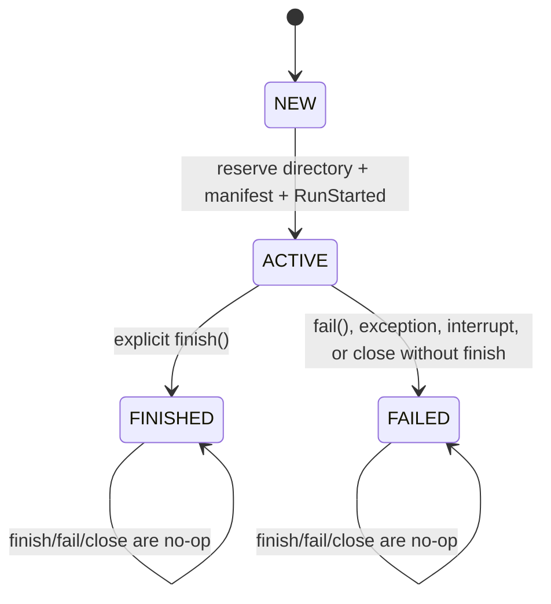

# Managed Run 生命周期

本文定义 Phase 1.1B 建立、并在 Phase 1.2A 扩展的正式运行边界。`ManagedRunContext` 只负责 provenance、事件和记录器、完成量统计、输出登记与终态收尾；它不拥有 Agent 决策、Prompt、市场定价、社交传播、杠杆或 validation 计算。Phase 1.2A 只在这一边界上加入正式 child-result 身份门、Provider capability snapshot 和非市场的 model qualification 运行类型，不改变市场科学语义。

## 两种运行边界

| 边界 | 用途 | 文件系统 / Git provenance | 正式研究结果 |
|---|---|---|---|
| `ManagedRunContext` | 正式 CLI 和正式 experiment driver | 创建不可覆盖的 run directory、manifest、公私事件、记录与终态 | 允许；只有 `FINISHED` 且 `managed_run_completed=true` 才是成功样本 |
| `NullRunContext` | 单元测试、数学性质测试、`repro_check` 子进程和明确的开发诊断 | 不创建目录、不写 manifest、不读取 Git | 不允许作为 provenance-complete 研究结果 |

`nmsim.sim.run_sim` 仍是低层 library API。它不会自动创建目录、读取 Git、加载凭据或建立 manifest；没有 observer 时仍可纯内存运行。正式入口负责先建立 `ManagedRunContext`，再把 `managed.observer` 和由 context 准备的 LLM 传给 `run_sim`。

`NullRunContext` 是显式的 no-op 生命周期适配器，不是安全沙箱。它自身不会联网或写文件，但调用方传入的函数或 Provider 仍可能产生副作用。使用它不会伪装成 managed run，也不会改变 `run_sim` 的返回值或价格轨迹。

正式入口清单及分类见 [ENTRYPOINTS.md](ENTRYPOINTS.md)。

## ManagedRunContext 责任

`ManagedRunContext` 复用 `RunManager` 和既有事件格式，统一承担：

- 原子预留 `out_root/runs/<run_id>/`；已有目录不会被覆盖；
- 创建和原子更新 manifest；
- 公共事件和权限为 `0600` 的私有事件/记录文件；
- `RecordingLLM` / `ReplayLLM` 的构造、严格 preflight 和消费完检查；
- LLM response source、Provider 接口调用和 completion 统计；
- resolved Provider 的脱敏 capability snapshot（描述性 provenance，不是质量评分）；
- 当前阶段、成功、失败、中断和资源关闭；
- 已有及部分输出的登记与 SHA-256；
- 仅在成功终态之后发布 legacy flat-output compatibility link。

它明确不负责 Agent、Prompt、市场、社交、风险或指标公式。文件系统对象不会继续下传到这些科学模块；仿真仅看到现有 Config、LLM 抽象和事件 observer。

## 状态机与幂等性

`managed_context.schema_version` 当前为 `1.0`。构造期间的内部瞬态是 `NEW`；一旦不可覆盖目录和初始 manifest 建立完成，就进入 `ACTIVE`。Manifest 中可观察到的正常起始状态是 `ACTIVE`。



终态规则如下：

- 一个 context 只能到达一个终态；
- `finish()`、`fail()` 和 `close()` 对终态 context 都是幂等 no-op；
- `finish()` 后再 `fail()` 不会改写成功记录；
- `fail()` 后再 `finish()` 不会把失败伪装为成功；
- `with` 块内已显式 `finish()` 时，`__exit__` 不会再次写 `RunFinished`；
- `with` 块抛出异常时，`__exit__` 写一次 `RunFailed` 并继续向上传播异常；
- `with` 块正常退出但调用方没有显式 `finish()` 时，`close()` 以 `finalization` 失败收尾，而不是默认宣告成功。

`RunFinished` 和 `RunFailed` 每个 managed attempt 最多各出现零或一次，并且不可能同时作为同一 context 的终态事件。

## 两阶段 CLI 启动

正式 CLI 使用两个逻辑阶段。`--help` 和 `--version` 是普通信息查询：正常退出，不创建 run directory，也不记作失败。

### Stage A：bootstrap

Bootstrap parser 只识别创建安全 provenance 所需的最少字段：输出根目录、可选 `run_id`、命令 identity、Replay source locator，以及入口支持时的 config 文件路径。它不解释完整科学配置。

Stage A 会先验证：

- `run_id` 只含允许字符，不能是 `.`、`..` 或路径穿越；
- output root 不含 NUL，且能解析为安全路径；
- help/version 不进入生命周期。

当前实现不会为每个成功命令在 Stage A 立即建立 provisional run：完整校验成功后直接用最终 Config 创建正式 context；如果 Stage B 失败，则使用已经安全解析的 root/run id 创建一个 `run_kind=bootstrap_attempt` 的 provisional managed attempt，再以失败终态封存。该 manifest 显式写入：

```text
bootstrap.provisional_config = true
bootstrap.effective_config_available = false
managed_context.full_validation_completed = false
```

Provisional manifest 中为建立目录而使用的 Mock Config 不是用户的有效科学配置，不能据此解释该失败命令的科学参数或 config hash。

### Stage B：full validation

Stage B 执行完整 argparse 校验、`Config.from_dict` strict ingestion、配置字段分类与 hash 构建、Provider 参数检查，以及 Strict Replay 的 schema/source/config/request preflight。未知字段、alias 冲突和科学配置不兼容不会进入第一轮仿真。

只要 Stage A 已经安全确定输出位置，Stage B 失败就留下：

- `status=failed` 的 manifest；
- `failure_stage` 和安全的 `failure_type`；
- 一个 `RunFailed`，但没有 `RoundStarted`；
- `provider_calls=0`、`network_access=false`（在 Provider 创建或 Replay preflight 之前失败时）；
- `outputs_complete=false`、`managed_run_completed=false`；
- 不发布 canonical success projection 或 legacy success link。

公共错误只包含脱敏的类型、选项/Config 字段名或安全的契约 hash 摘要；输入值、API key、Authorization、完整 Prompt 和 private rationale 不进入公共输出。详细错误仅写入私有记录。

## 无法创建 provenance 的极早期错误

以下错误发生在安全 run directory 可以确定之前，因此可能只有非零退出和 `provenance_not_created_reason`，没有 manifest：

- output root 含非法内容或无法安全解析；
- `run_id` 非法或包含路径穿越；
- 当前用户无法在任何确定的安全 root 创建目录；
- bootstrap parser 无法可靠确定输出位置；
- 预留 attempt directory 本身失败。

这类错误只打印脱敏原因类型，不回显用户输入值。它们不能被伪造成已经进入 managed lifecycle 的失败运行。

## 执行流程

正式单次仿真的当前流程是：

1. 入口完成安全 bootstrap 和完整 Config 校验。
2. `ManagedRunContext.create()` 原子预留目录，写 running manifest 和 `RunStarted`。
3. `prepare_llm()` 进入 `provider_setup` 或 `replay_preflight`。
4. Record 模式构造 Provider/cache 后包裹为 `RecordingLLM`；Replay 模式只构造 `ReplayLLM`，不构造底层 Provider。
5. `execute_simulation()` 进入 `simulation`，调用低层 `run_sim` 并由 observer 统计事件。
6. Replay 在仿真后验证历史记录全部消费。
7. 入口进入 `result_export`，把 canonical 输出写入不可变 run directory。
8. `finish()` 同步 LLM/completion，hash 输出，写一次 `RunFinished`，更新 finished manifest。
9. 成功终态建立后，才可按兼容需要发布 `latest` 和 flat links；flat link 直接指向产生该文件的不可变 run，而不是经由之后可能变化的 `latest`。

输出文件存在不表示运行成功。只有 terminal manifest 的 `status=finished`、`outputs_complete=true` 和 `managed_run_completed=true` 共同表示完整 managed research run。

## failure_stage

| stage | 当前含义 | 典型失败 |
|---|---|---|
| `bootstrap` | attempt 预留和生命周期初始化，或 active context 未进入下一阶段即被关闭 | 目录/manifest 建立、过早关闭 |
| `config_validation` | 完整 argparse、strict Config ingestion、字段分类和 effective Config 构造 | 未知 key、alias 冲突、非法配置 |
| `provider_setup` | Mock/真实 Provider、cache 和 `RecordingLLM` 构造 | Provider 配置或构造错误 |
| `replay_preflight` | schema 1.2、源码/Config/model/request identity 的离线严格校验 | `ReplayMismatchError`、malformed/legacy recording |
| `simulation` | `run_sim` 以及当前仿真后 Replay 完整消费检查 | 第 N 轮异常、未消费完 recording |
| `result_export` | CSV/JSON/PNG 等结果序列化和落盘 | 写入、权限、绘图错误 |
| `finalization` | completion 同步、artifact hash、terminal event/manifest，或未显式 finish 的 close | hash/终态写入错误、生命周期误用 |

`failure_stage` 描述失败时所在的 managed 边界，不是科学机制分类。Replay schema/config mismatch 在第一轮前属于 `replay_preflight`；Replay 结束时发现多余记录目前属于 `simulation`。

## 异常、中断与部分结果

- 普通 `Exception`：当前 completion 先同步，随后写 `FAILED` 和 `RunFailed`，异常继续传播给上层。
- `KeyboardInterrupt`：保存当前 completion，`failure_type=keyboard_interrupt`，执行失败终态落盘，保持 failed，不伪装为 finished。
- managed 生命周期内的 `SystemExit`：同样失败封存，`failure_type=system_exit`。
- `SIGKILL`、断电和进程崩溃：进程无法执行 finalization；磁盘上可能保留 running manifest 和已刷新的事件。恢复工具必须把它视为未完成 attempt，不能推断成功。

若第 N 轮失败，已存在文件仍可登记和 hash，但 `outputs_complete=false`，该 run 不进入 `honest_n_runs`。若仿真计算完成而 export 失败，则：

```text
simulation_computation_completed = true
completion.simulation_runs.completed = 1
managed_run_completed = false
outputs_complete = false
status = failed
```

这一区分允许审计“计算跑完”和“正式研究运行完成”，但后者才是实验成功样本。失败运行绝不更新成功 `latest` 或 legacy projection。

## Record / Replay 生命周期边界

新 Record 继续只写 `recording_schema_version=1.2`。Phase 1.1A 产生的完整 schema 1.2 recording，只要科学源码、运行时科学 Config、model request 和逐请求 identity 匹配，仍可在当前代码上 Strict Replay。

Replay preflight 在第一轮、第一条历史响应消费和任何 Provider 构造之前完成。Mismatch 没有网络 fallback，失败 manifest 中 Provider call 保持 0。Git commit 可以不同；compatibility 仍由既有 scientific fingerprint、schema/hash 和 request identity 契约决定。详细规则见 [REPLAY_COMPATIBILITY.md](REPLAY_COMPATIBILITY.md)。

Phase 1.2A 在 resolved Provider 已知时向 manifest 增加可选的
`llm.provider_capability_snapshot`。它使用 capability schema `1.0`，只保存审阅过的 adapter 特性、安全 endpoint identity 与 snapshot hash，不保存 credential。该字段不进入 recording schema 1.2 必填结构，也不改变 Strict Replay 契约；因此缺少它的 Phase 1.1 完整 schema 1.2 recording 仍可在其他 strict identity 一致时重放。未登记的 resolved Provider 在请求前 fail closed，但 registry 不构造、不调用 Provider，也不衡量模型质量。

## Driver resume 与历史分析输入

Batch driver 的 parent `ManagedRunContext` 在启动 child 前使用
`nmsim.result_reuse` 的 policy `1.0` 审查候选。候选必须是在允许 result root 内的完整 managed simulation，并同时匹配生命周期、科学源、运行时科学 Config、模型请求、Scenario/input、seed、population 和注册 artifact 字节。安全目录外的 symlink、无 manifest 的平铺文件或被篡改的 artifact 都会以稳定 reason code 拒绝。

只有合法候选增加 `reused_runs` 和 `honest_n_runs`。拒绝不覆盖旧 run，而是记录脱敏 audit 并启动新的不可覆盖 child。Git commit 差异不是单独阻断条件；科学指纹和其他严格身份完全相同时可按策略跨 commit 复用。

显式的 historical analysis 另走 `analysis` run：输入文件记录路径、大小、hash 和 `provenance_class=legacy_unverified_input`，但不伪造 child manifest，不进入 executed/reused/honest-N 计数。完整契约见 [RESULT_REUSE_POLICY.md](RESULT_REUSE_POLICY.md)。

## Model qualification 生命周期

`experiments.model_qualification` 使用同一个 managed 终态机，但
`run_kind=model_qualification` 且不调用 `run_sim`。Mock 和 qualification-only Fake 保持离线路径；Phase 1.2B-CX1 仅为实验性 CodexExec 增加显式 model、真实使用确认、case-count 二次确认和单 worker 保护。未满足保护或选择其他外部 Provider 时，在构造前以 `provider_setup` 失败，Provider call 为 0、`network_access=false`。`--dry-run` 不构造 Provider；Mock/Fake 固化完整 48-case 计划，CodexExec 默认只固化 1-case pilot 选择及其 hash。

完成的 Mock qualification 把 case 计入 logical request/decision 以及独立的 `qualification_cases`，但 `simulation_runs=0`、`rounds=0`、`honest_n_runs=0`。公共 case/aggregate 文件不含 private rationale；完整 Prompt、raw response 和 rationale 只进入 `0600` 私有文件。该协议不是“唯一正确动作”测试，也不代替统计验证。

## 公私边界与限制

- private rationale、原始私有错误和敏感记录只进入权限为 `0600` 的私有文件；
- 公共事件、公共 CLI 错误和 driver summary 不包含 private rationale 正文；
- `network_access` 表示当前 LLM 路径是否允许/需要网络：Mock 和 Replay 为 `false`。它不是逐个 TCP/HTTP 包的抓包证明；
- Provider call 只统计穿透 cache/replay 后抵达 Provider 接口的逻辑请求。SDK 内部不可观察的 retry 不在覆盖范围内；
- finalization 只能处理进程可捕获的异常；不能承诺处理 `SIGKILL` 或机器故障；
- `NullRunContext` 输出没有完整 provenance，不能与 managed finished run 等价。

Completion 的字段、单位和 run-level honest-N 规则见 [COMPLETION_ACCOUNTING.md](COMPLETION_ACCOUNTING.md)。
